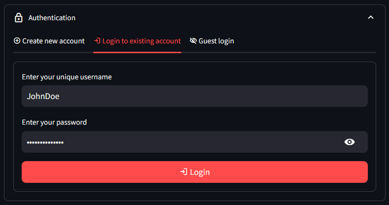

# :lock: st-login-form
[](https://pepy.tech/project/st-login-form)

A streamlit component that creates a user login form connected to a Supabase DB. It lets users create a new username and password, login to an existing account, or login as an anonymous guest.



The login form collapses after login to free screen-space.

## :computer: Demo app
[](https://st-lgn-form.streamlit.app/)

## :construction: Installation

1. Install `st-login-form`
```sh
pip install st-login-form
```
2. Create a Supabase project as mentioned [here](https://docs.streamlit.io/knowledge-base/tutorials/databases/supabase#sign-in-to-supabase-and-create-a-project)
3. Create a table to store the usernames and passwords. The table name and column names can be as per your choice.
```sql
CREATE TABLE users (
    username text not null default ''::text,
    password text not null,
    constraint users_pkey primary key (username),
    constraint users_username_key unique (username),
    constraint users_password_check check (
      (
        length(
          trim(
            both
            from
              password
          )
        ) > 1
      )
    ),
    constraint users_username_check check (
      (
        length(
          trim(
            both
            from
              username
          )
        ) > 1
      )
    )
  ) tablespace pg_default;
```
4. Follow the rest of the steps from [here](https://docs.streamlit.io/knowledge-base/tutorials/databases/supabase#copy-your-app-secrets-to-the-cloud) to connect your Streamlit app to Supabase


## :pen: Usage

`login_form()` sets `session_state["authenticated"]` to `True` if the login is successful, `session_state["username"]` to the `username` or new or existing user, and to `None` for guest login.

Returns the initialized `supabase.Client` instance to let you interact with the databse downstream in the script.

```python
import streamlit as st

from st_login_form import login_form

client = login_form()

if st.session_state["authenticated"]:
    if st.session_state["username"]:
        st.success(f"Welcome {st.session_state['username']}")
    else:
        st.success("Welcome guest")
else:
    st.error("Not authenticated")
```

[](https://st-lgn-form.streamlit.app/)

## 🤗 Want to support my work?
<p align="center">
    <a href="https://www.buymeacoffee.com/siddhantsadangi" target="_blank">
    </a>
</p>
